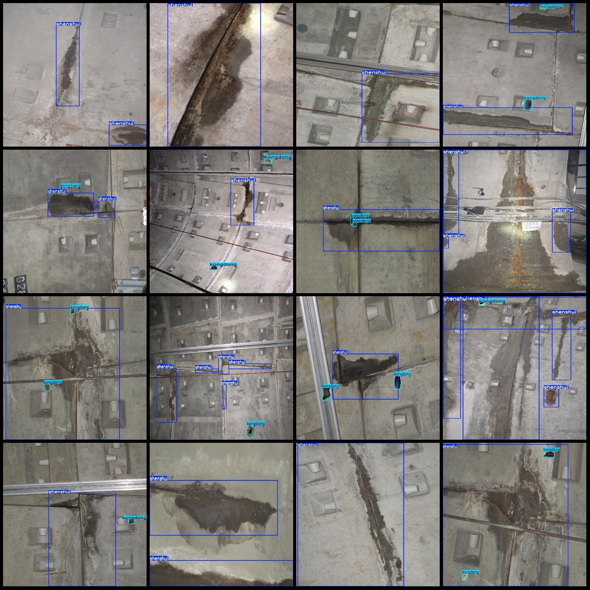
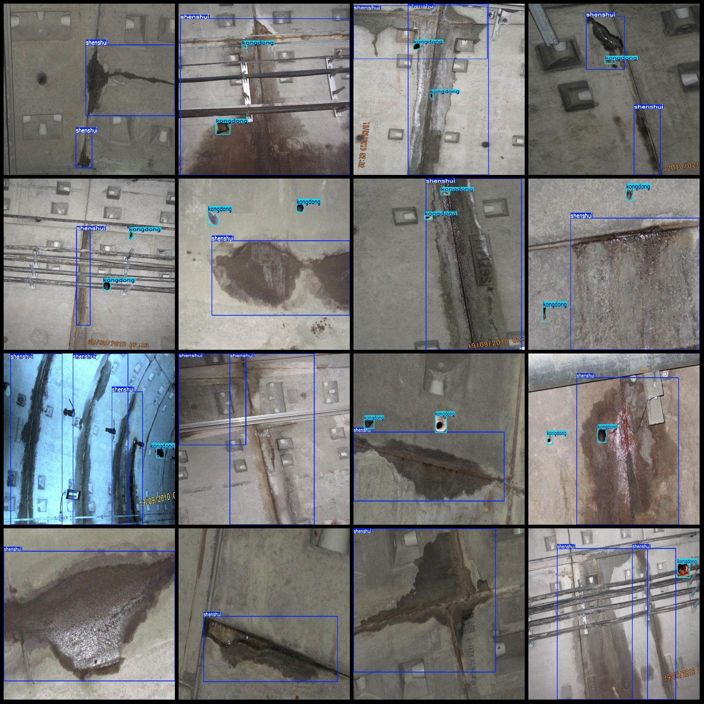
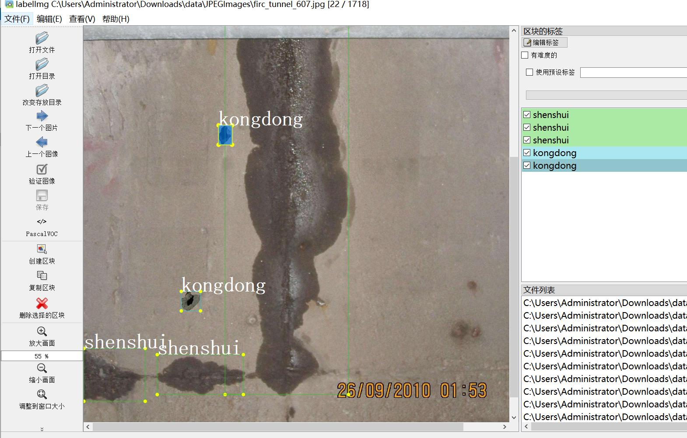

# Tunnel Water Leakage Hole Detection Data Set (VOC+YOLO) - 1717 Images, 2 Categories

Dataset format: Pascal VOC format + YOLO format (txt file without split path, only containing jpg images along with corresponding VOC format xml files and YOLO format txt files)
Number of images (jpg file count): 1717
Number of annotations (xml file count): 1717
Number of annotations (txt file count): 1717
Number of categories: 2
Annotation category names (note that the order in the yolo format is not consistent with this, but refer to the labels folder's classes.txt for reference): ["kongdong", "shenshui"]
Boxes per category:
- kongdong (holes) = 1740 boxes
- shenshui (water leakage) = 2709 boxes
Total boxes: 4449
Number of images per category:
- kongdong = 1143 images
- shenshui = 1717 images
Image resolution: Multi-resolution images, such as 1438x1078, 1078x1438 etc.
Annotation tool used: labelImg
Annotation rules: Draw a rectangle around the category
Important note: The dataset does not have a division into training, validation, or test sets; users must divide it themselves.
Special declaration: This dataset does not guarantee the accuracy of the trained model or weight files.
Image preview:
Annotation example:
LabelImg editing example:

## Image

Here is a pay link on Stripe ( https://buy.stripe.com/3cs8yP7sY87d0vu9AB ). Please contact me lonlonago@foxmail.com after funding $89, and I will send you a complete data files , thank you!

